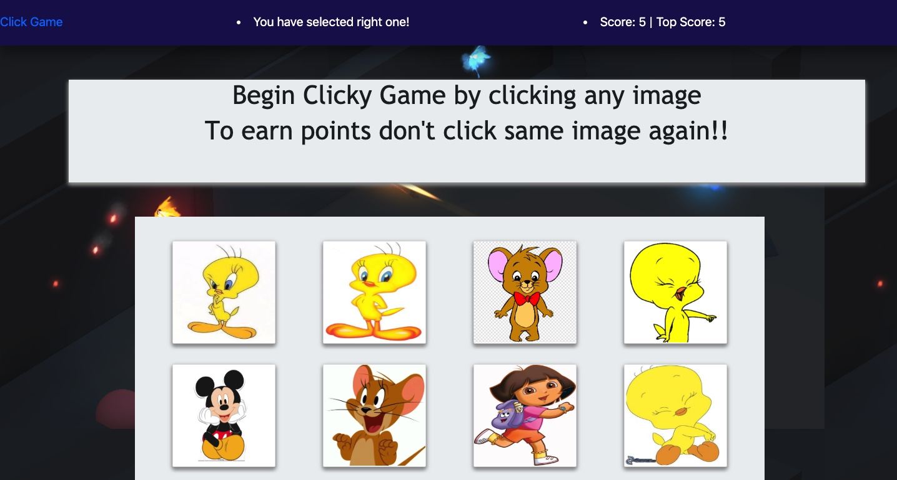

# clicky-Game
 Heroku deployed URL :  https://react-memories-demo-app.herokuapp.com/
## Description	
Clicky Game is the memory games creates in React. this memory game assignment is builded using breakdown up application's UI into components, manage component state, and respond to user events.	Clicky Game is the memory games creates in React. this memory game assignment is builded using breakdown up application's UI into components, manage component state, and respond to user events.
It render different images which listen to click event from the user and keep track of what image user has been clcik. Base on the clcik event the game application has  logic to reset game, inform you select right image or you select the image that already been click and keep track of your highest score.	It render different images which listen to click event from the user and keep track of what image user has been clcik. Base on the clcik event the game application has  logic to reset game, inform you select right image or you select the image that already been click and keep track of your highest score.
@@ -21,4 +22,4 @@ Here are the steps for running this application locally in your machine.
## Installation
Follow following steps for Installation of app in your local machine.

1. Go to https://github.com/lamashree/clicky-Game
2. click on clone or download from the right side of the page. copy it.
3. git clone Repo.
4. change directory to the Repository.
5. npm install and other dependencies
Or click on the link at the first line of the page.
## Technoligies used
1. HTML
2. Bootstrap
3. Node js
4. React
3. JavaScript
5. NPM packages
## Using the App
 	 
 The clciky game I developed can be see on the above image. This is a single page game application where user can see what is their top score and are user clciking the same image again or not. The navbar message keep changing with the user click event.	 The clciky game I developed can be see on the above image. This is a single page game application where user can see what is their top score and are user clciking the same image again or not. The navbar message keep changing with the user click event.